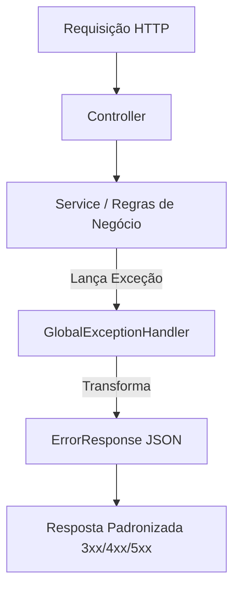

# Global Exception Handler 🚀
### Biblioteca Spring Boot para centralização e padronização de tratamento de exceções em microserviços Java.

## 2. Status do Projeto
> **MVP Concluído** ✅ (Pronto para uso como dependência em outros projetos)

## 3. Arquitetura / Visão Técnica
A biblioteca atua na camada de **Infraestrutura/Cross-cutting** das aplicações. Utiliza a anotação `@RestControllerAdvice` do Spring Web para interceptar exceções lançadas em qualquer camada (Controller, Service ou Repository) e transformá-las em um contrato de erro padronizado antes da resposta ao cliente.



## 4. Stack Técnica
- **Linguagem:** Java 21
- **Framework:** Spring Boot 3.5.11
- **Boilerplate:** Lombok
- **API:** Jakarta Servlet API
- **Build Tool:** Maven

## 5. Funcionalidades Principais
- **Captura Automática:** Intercepta exceções globais sem necessidade de blocos `try-catch` em cada endpoint.
- **Contrato Único:** Garante que todos os erros da API tenham o mesmo corpo JSON.
- **Custom Exceptions:** Conjunto de classes de exceção semânticas (ex: `ConflictException`, `ResourceNotFoundException`).
- **Tratamento de Fallback:** Captura erros genéricos (500) para evitar vazamento de stacktrace para o cliente.

## 6. Endpoints Principais
Como este projeto é uma **biblioteca**, ele não expõe endpoints próprios. Ele é injetado em outros microserviços para gerenciar os endpoints existentes neles.

## 7. Como Rodar Localmente
### Pré-requisitos
- JDK 21
- Maven 3.9+

### Instalação
1. Clone o projeto:
   ```bash
   git clone https://github.com/betolara1/Global-Exception-Handler.git
   ```
2. Instale no seu repositório local Maven:
   ```bash
   mvn clean install
   ```

### Uso em outro projeto
Adicione a dependência no seu `pom.xml`:
```xml
<dependency>
    <groupId>com.betolara1</groupId>
    <artifactId>Global-Exception-Handler</artifactId>
    <version>1.0.0</version>
</dependency>
```

## 8. Variáveis de Ambiente / Configuração
Para ativar o Handler no seu projeto Spring Boot, você deve configurar o scan de pacotes na sua classe principal:

```java
@SpringBootApplication(scanBasePackages = {
    "seu.pacote.base", 
    "com.betolara1.Global_Exception_Handler"
})
public class Application { ... }
```

## 9. Segurança
- **Ocultação de Detalhes:** O handler para `Exception.class` (500) retorna uma mensagem genérica, ocultando detalhes técnicos do servidor que poderiam ser explorados.
- **CORS e Filtros:** Por atuar no nível de `@RestControllerAdvice`, o handler respeita as configurações de CORS definidas no projeto principal.

## 10. Estrutura do Projeto
```text
src/main/java/com/betolara1/Global_Exception_Handler/
├── dto/
│   └── ErrorResponse.java        # Modelo padrão de saída
├── exception/
│   ├── GlobalExceptionHandler.java # Lógica central de captura
│   ├── BadRequestException.java   # Exceção customizada 400
│   └── ...                        # Demais exceções (404, 401, 403, etc)
```

## 11. Próximos Passos
- [ ] Suporte para validações do `javax.validation` (`@Valid`).
- [ ] Suporte para múltiplas mensagens de erro em uma única resposta (listas).
- [ ] Internacionalização (i18n) das mensagens de erro.

## 12. Diagrama de Resposta
**Exemplo de Resposta de Erro (ErrorResponse):**
```json
{
  "timestamp": "2024-03-20T10:00:00",
  "status": 400,
  "error": "Requisição Inválida",
  "message": "Mensagem detalhada do erro",
  "path": "/api/exemplo"
}
```

### Exceções Disponíveis

A biblioteca fornece as seguintes exceções prontas para uso:

| Exceção | Status HTTP | Descrição |
| :--- | :--- | :--- |
| `BadRequestException` | 400 Bad Request | Requisição mal formatada ou violação de regra. |
| `UnauthorizedException` | 401 Unauthorized | Falha na autenticação. |
| `ForbiddenException` | 403 Forbidden | Acesso negado. |
| `ResourceNotFoundException` | 404 Not Found | Recurso não encontrado. |
| `MethodNotAllowedException` | 405 Method Not Allowed | Método HTTP não permitido. |
| `ConflictException` | 409 Conflict | Conflito de estado (ex: registro duplicado). |
| `PreconditionFailedException`| 412 Precondition Failed | Pré-condição não atendida. |
| `MovedPermanentlyException` | 301 Moved Permanently | Recurso movido permanentemente. |
| `Exception` (Genérica) | 500 Internal Error | Qualquer erro não mapeado. |

### Exemplo de Lançamento de Exceção

```java
@Service
public class UsuarioService {
    public void buscarPorId(Long id) {
        throw new ResourceNotFoundException("Usuário com ID " + id + " não encontrado.");
    }
  "timestamp": "2024-03-16T15:20:00",
  "status": 404,
  "error": "Não Encontrado",
  "message": "Usuário não encontrado com o ID fornecido",
  "path": "/api/users/10"
}
```

## 👤 Autor

- **Beto Lara** - *Desenvolvedor Principal*

---
Desenvolvido para facilitar a vida de quem constrói Java com Spring Boot. ☕
